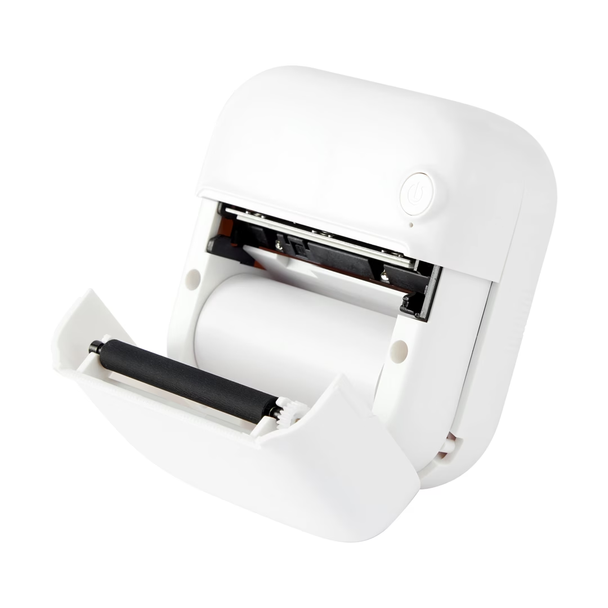

# YHK Mini Printer

Browser-based control for cheap BLE mini thermal printers. Connect over Web Bluetooth from Chrome and print raster images using ESC/POS (`GS v 0`) commands.

**Live demo:** [joshmcarthur.github.io/yhk-mini-printer](https://joshmcarthur.github.io/yhk-mini-printer/) (requires Chrome/Edge — Web Bluetooth needs HTTPS)

In theory, any pocket thermal printer that accepts **rasterized bytes over BLE** via an ISSC-style UART service should work. Compatibility depends on the BLE GATT profile and whether the firmware accepts ESC/POS bitmap commands (many cheap "cat printer" class devices do).

**Status:** Phase 1 proof of concept — protocol validated from the browser. Long-term target is a [Pi print server](docs/architecture.md) for iOS, remote printing, and webhooks.



## Demo

**Web app** — connect and print from Chrome:

<video src="docs/images/screen-record.webm" controls width="720">
  <a href="docs/images/screen-record.webm">Download screen recording</a>
</video>

**Printer output** — test image on paper:

<video src="docs/images/demo.webm" controls width="720">
  <a href="docs/images/demo.webm">Download demo video</a>
</video>

## Supported devices

| Device | BLE name | BLE profile | ESC/POS raster | Status | Notes |
|--------|----------|-------------|----------------|--------|-------|
| [Kmart Thermal Bluetooth Printer](https://www.kmart.co.nz/product/thermal-bluetooth-printer-43437771/) (SKU 43437771) | `YHK-*` | ISSC UART | `GS v 0` | **Tested** | Primary dev device; 58mm head, ~384 dots wide |
| YHK-962D | `YHK-*` | ISSC UART | `GS v 0` | **Tested** | Same class of printer as above |

### Compatibility criteria

A printer is likely compatible if it meets all of:

1. **BLE peripheral** with a UART-like GATT service (ISSC `49535343-…` is common on this hardware).
2. **Writable TX characteristic** supporting `writeWithoutResponse`.
3. **ESC/POS raster** — accepts `GS v 0` (`1D 76 30 00`) bitmap data; text commands may not work.
4. **~384 dot print width** (48 bytes/row) for 58mm paper — adjust image width if your model differs.

Printers using a different BLE service UUID, a proprietary binary protocol (e.g. cat-printer `0xAE30`), or Classic Bluetooth SPP only will **not** work without a new transport implementation.

If you get a connection but garbled output, see [protocol.md](docs/protocol.md) for UUID discovery and pacing tuning. PRs adding tested devices to this table are welcome.

## Quick start

```bash
npm install
npm run dev
```

Open [http://localhost:5173](http://localhost:5173) in **Chrome or Edge**.

1. Power on the printer (disconnect from phone apps first).
2. Click **Connect** → select `YHK-...` in the picker.
3. Click **Print Test Image**.

### QR Composer

Open [http://localhost:5173/qr.html](http://localhost:5173/qr.html) (or use the **QR** nav link).

1. Connect to the printer.
2. Choose a payload type: **URL**, **Plain text**, or **Wi-Fi**.
3. Optionally add a caption and adjust QR size (180–300px).
4. Check the live preview, then click **Print**.

Wi-Fi QR codes use the standard `WIFI:` format — scan with your phone camera to join the network.

## Requirements

| | |
|---|---|
| **Browser** | Chrome or Edge (desktop/Android). Not Safari/iOS. |
| **Host** | `localhost` or HTTPS |
| **Printer** | BLE thermal with ISSC UART + ESC/POS raster (see [Supported devices](#supported-devices)) |

## Documentation

| Doc | Contents |
|-----|----------|
| [Architecture](docs/architecture.md) | Phased roadmap, `PrinterTransport`, Pi server plan |
| [Protocol](docs/protocol.md) | BLE UUIDs, ESC/POS, chunk pacing, tuning |
| [Exploration notes](docs/exploration/chatgpt.md) | Early research and UUID discovery |

## Project layout

```
shared/
├── constants.ts               # PRINTER_WIDTH, BLE pacing constants
└── escpos.ts                  # ESC/POS encoding
src/
├── main.ts                    # Test image UI
├── qr.ts                      # QR composer UI
├── composer/
│   ├── compose.ts             # Receipt layout + QR rendering
│   └── presets.ts             # Wi-Fi / URL / text payload helpers
├── ui/
│   └── connection.ts            # Shared BLE connect UI
├── transport.ts               # PrinterTransport + paced sendChunked()
├── transport/web-bluetooth.ts # Web Bluetooth (Phase 1)
└── image.ts                   # Test pattern + thresholding
```

## Build

```bash
npm run build          # local build (base /)
npm run build:pages    # GitHub Pages build (base /yhk-mini-printer/)
npm run preview        # serve production build locally
```

Deploys to GitHub Pages automatically on push to `main` via [`.github/workflows/deploy.yml`](.github/workflows/deploy.yml).

## Troubleshooting

| Symptom | Fix |
|---------|-----|
| Bottom of image missing | Increase `BLE_CHUNK_DELAY_MS` in `src/transport.ts` (try 50–60) |
| Service not found | Wrong UUIDs — see [protocol.md](docs/protocol.md#uuid-discovery) |
| Upside-down output | Rotate image 180° before encoding |
| Web Bluetooth unavailable | Use Chrome/Edge on localhost or HTTPS |

## Roadmap

- [x] **Phase 1** — Web Bluetooth PoC, test image print
- [ ] **Phase 2** — Pi print server, native BLE
- [ ] **Phase 3** — HTTP client transport (iOS, remote)
- [ ] **Phase 4** — Webhooks, queue, auth

## License

MIT
