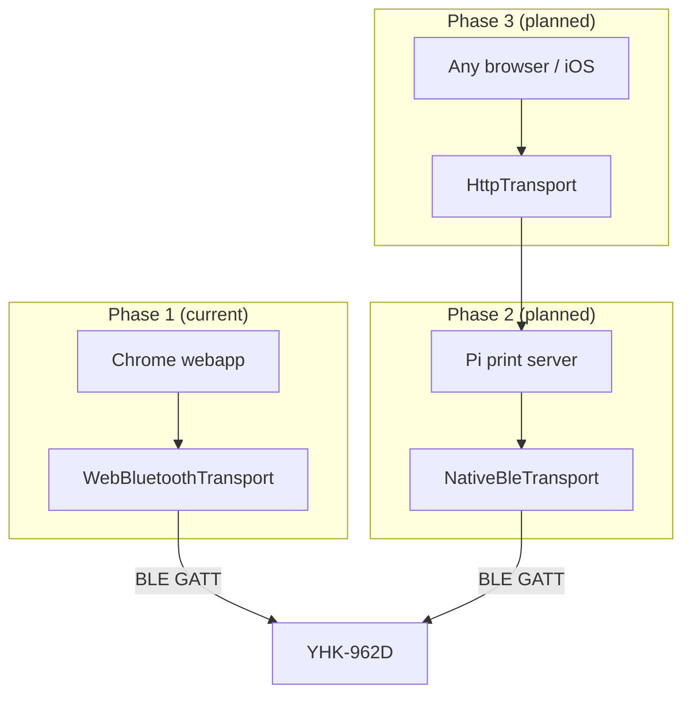

# Architecture

## Overview

This project prints to YHK-series mini thermal printers (tested against YHK-962D). Phase 1 is a browser webapp that talks to the printer over Web Bluetooth. The long-term target is a Raspberry Pi print server that holds the BLE connection and accepts print jobs over HTTP.



## PrinterTransport

All transports implement the same interface so print encoding stays platform-agnostic:

```typescript
interface PrinterTransport {
  readonly connected: boolean;
  connect(): Promise<void>;
  disconnect(): Promise<void>;
  send(data: Uint8Array): Promise<void>;
}
```

| Transport | Status | Runs where | Connect |
|-----------|--------|------------|---------|
| `WebBluetoothTransport` | Implemented | Browser (Chrome) | Device picker |
| `NativeBleTransport` | Planned | Pi daemon | Paired MAC address |
| `HttpTransport` | Planned | Browser | `POST` to Pi API |

Shared modules used by every phase:

- `escpos.ts` — ESC/POS command encoding (`ESC @`, `GS v 0` raster, feed)
- `image.ts` — Canvas rendering, threshold to 1-bit bitmap
- `transport.ts` — `sendChunked()` with BLE pacing

## Print pipeline

1. Generate or load a monochrome bitmap (384 dots wide for 58mm paper).
2. `buildPrintJob(pixels)` → single `Uint8Array` of ESC/POS bytes.
3. `transport.send(job)` — paced BLE writes in 182-byte chunks.

See [protocol.md](./protocol.md) for wire-format details.

## Phased roadmap

| Phase | Deliverable | Motivation |
|-------|-------------|------------|
| **1** | Web Bluetooth PoC | Fast protocol validation from a laptop |
| **2** | Pi print server + native BLE | Headless, always-on printing |
| **3** | `HttpTransport` in web client | iOS Safari, remote access |
| **4** | Webhooks, queue, auth | Jira, agents, multi-user |

### Phase 2 sketch

```
server/
├── main.ts              # HTTP server
├── transport/
│   └── native-ble.ts    # Python Bleak or Node simpleble
└── routes/
    ├── health.ts
    └── print.ts         # POST → buildPrintJob → transport.send()
```

The Pi sits next to the printer, pairs once, and exposes e.g. `http://pi.local:8080/print`.

## Why not browser-only long term?

| Goal | Browser BLE limitation |
|------|------------------------|
| iOS / Safari | No Web Bluetooth |
| Remote printing | User must be in BLE range |
| Webhooks (Jira, etc.) | No server to receive HTTP |
| Multiple senders | One tab, one connection |

Web Bluetooth remains useful for development and quick local tests even after the Pi server exists.
